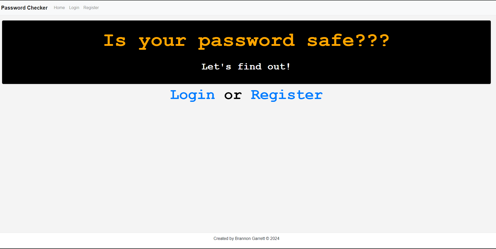

# Password Checker
#### Video Demo:  https://youtu.be/mrRRXgkaSQU

#### Project Image:

#### Description:
Project: Password Checker by Brannon Garrett

The Password Checker is a web application designed to help users check if any password has been seen around the internet before and how many times it has been seen. The project is built using Python and Flask, and it incorporates various HTML and CSS elements for the frontend. The project also uses Python, SQL, JavaScript, Bootstrap, and the api.pwnedpasswords, Jinja2, and Font Awesome.

## File Descriptions

app.py

This is the main application file. It sets up the Flask application, configures the database, defines the User and CheckedPassword models, and contains all the routes for the application. It handles user registration, login, password checking, and history viewing.

## history.html

This HTML file extends the layout.html file and contains a table that displays the history of checked passwords. It shows the hashed password, the number of times it has been seen, and the date and time it was checked.

## layout.html

This is the main layout file for the web application. It sets up the basic structure of the web pages, including the header, navigation bar, and main content area. It also includes links to Bootstrap CSS for styling, jQuery and Popper.js for functionality, and a custom CSS file for additional styles.
The layout.html file also includes several JavaScript functions. These include a function to display flash messages in the header, a typing effect script for certain paragraphs, a script to show a loading spinner during form submission, a password strength meter script, and a script to toggle password visibility.

## register.html

This file extends the layout.html file and contains the form for user registration. It includes fields for username, password, and password confirmation. Each field includes error handling to display messages if the input is invalid.
The register.html file also includes a password strength meter, which provides visual feedback on the strength of the entered password. This is implemented using a progress bar and text that updates based on the calculated strength of the password.

## index.html

This HTML file extends the layout.html file and contains a form for users to check any password. It also includes a loading spinner for visual feedback during processing.

## Design Choices

The decision to use Flask for this project was based on its simplicity and flexibility for small to medium-sized applications. Flask allows for easy setup and development, and it provides enough functionality for this project without the overhead of a larger framework.
The use of Bootstrap for styling was chosen for its ease of use and wide range of components. It allows for responsive design, ensuring the application looks good on various screen sizes.
The password strength meter was included to provide immediate feedback to the user about the strength of their password. This encourages users to choose stronger, more secure passwords.
The project is designed to be simple yet functional, providing a useful service while also demonstrating various aspects of web development with Python and Flask.
